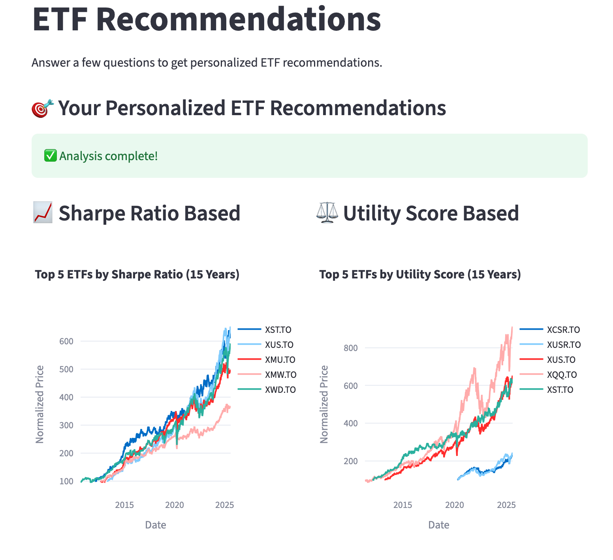

# ETF Recommendation System

## Overview
A data-driven investment platform that delivers personalized ETF recommendations using advanced financial modeling.



## Key Features
- **Dual Recommendation Engines**: Sharpe Ratio analysis + Custom Utility scoring
- **Risk Management**: Maximum drawdown filtering with rolling window analysis
- **Interactive Web App**: Streamlit-based interface with real-time data processing
- **Performance Visualization**: Dynamic charts with Plotly and comparative analysis

## Tech Stack
- **Backend**: Python, Pandas, NumPy
- **APIs**: yfinance, Bank of Canada (real-time data)
- **Frontend**: Streamlit, Plotly
- **ML/Finance**: Modern Portfolio Theory, statistical modeling
- **Architecture**: Modular design with caching and testing


## Core Algorithms

### Sharpe Ratio Method
```python
excess_return = annual_growth - risk_free_rate
sharpe_ratio = excess_return / standard_deviation
```

### Custom Utility Score
```python
# Z-score normalization + weighted risk-return optimization
utility_score = W_return * z_excess_return - W_risk * z_risk
```

## Project Structure
- `core/`: Core business logic and algorithms
- `web_app/`: Streamlit web application
- `visualization/`: Charting and plotting functions
- `testing/`: Testing and validation modules
- `config/`: Configuration and constants


## Getting Started

### **Prerequisites**
- Python 3.8 or higher
- pip package manager

### **Installation**
```bash
# Clone the repository
git clone https://github.com/your-username/etf-recommendation-system.git
cd etf-recommendation-system

# Install dependencies
pip install streamlit yfinance pandas numpy plotly requests scikit-learn

# Launch the application
cd Code
streamlit run web_app/app.py
```

## Authors

**Aria Druker**
**Linghe Zhou**
